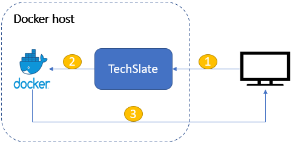

## TechSlate

TechSlate provides web interface for starting and stopping docker containers. TechSlate has custom docker images which allows user to access docker terminals via browser. TechSlate also allows user to open ports, assign labels to the containers they launch. The user has the flexibility to continue working on their projects using the web-terminals.

### Architecture diagram:

1. Client request TechSlate for start / stop of docker containers.
2. TechSlate assigns nodePort to ssh port of the docker container while launching the containers.
3. Using the nodePort, client can directly interact with docker containers using web-terminals.

### Use cases:
- Application development - Since the docker containers already contain the necessary softwares (programming languages) they can start using it for development purpose.
- Small training institutes where they teach specific programming languages.
- Online training portals - if they extent this application with public cloud like GCE, AES etc.. then it is pretty much capable of doing it.
- Online examination - since every user gets an unique docker container and the data is not saved over the containers, this will be useful.

### Installation instructions:

#### Pre-requisite:
- OS: Linux
- Python3
- Docker

#### Steps:
1. Clone the repository and move inside the application directory.
2. Run './install.sh' script which will pull the required docker images and then install the required python packages.
3. Run the command 'python3 bin/techslate.py' and then open http://localhost:5555 in browser.

Please find the API details **[here](https://github.com/parthibann/TechSlate/blob/main/documents/apidetails.md)**.
