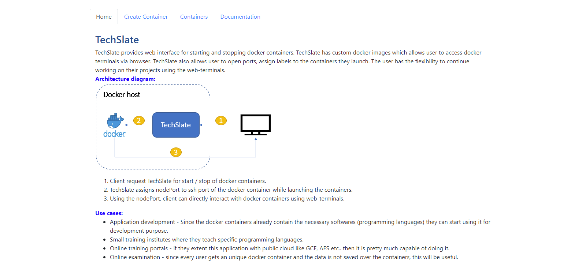
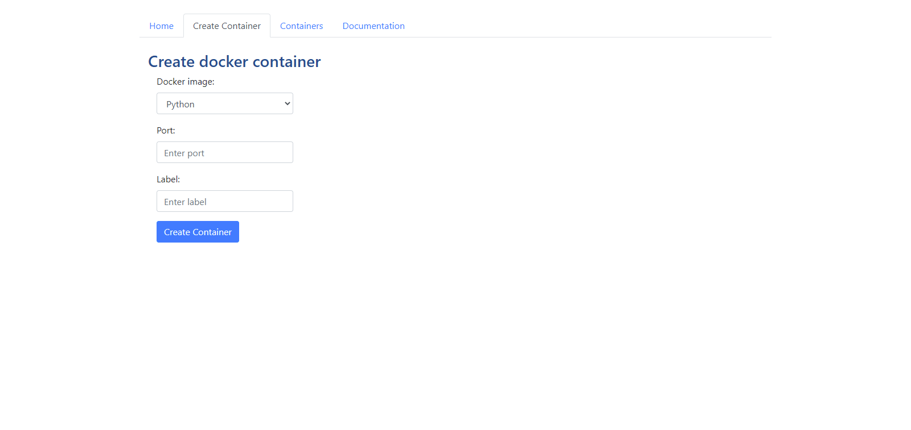
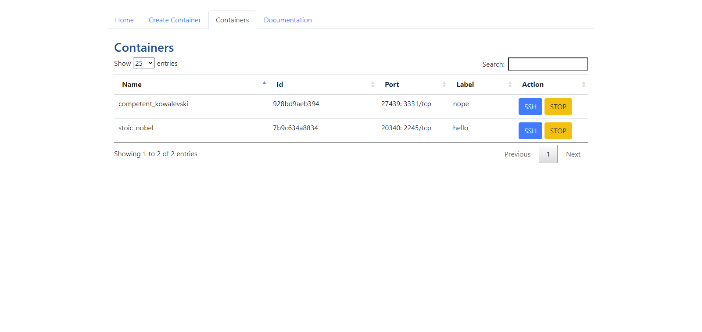
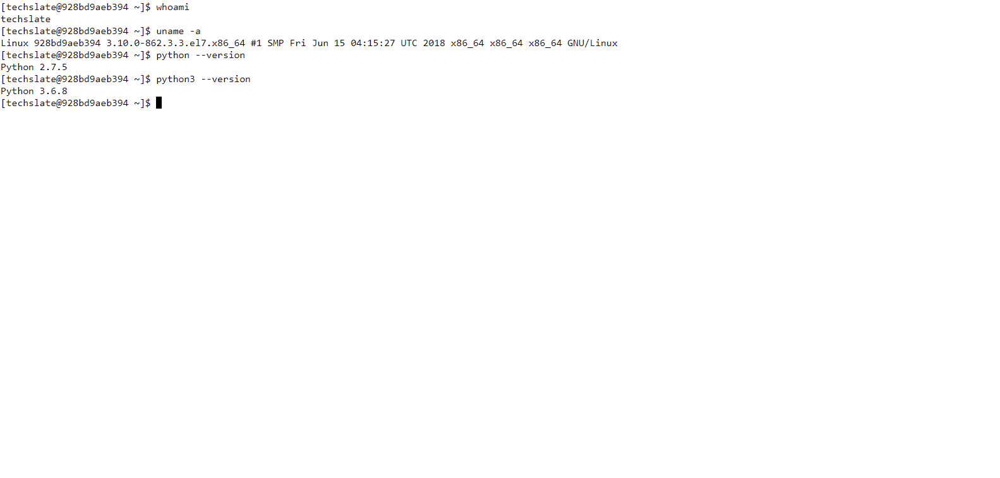
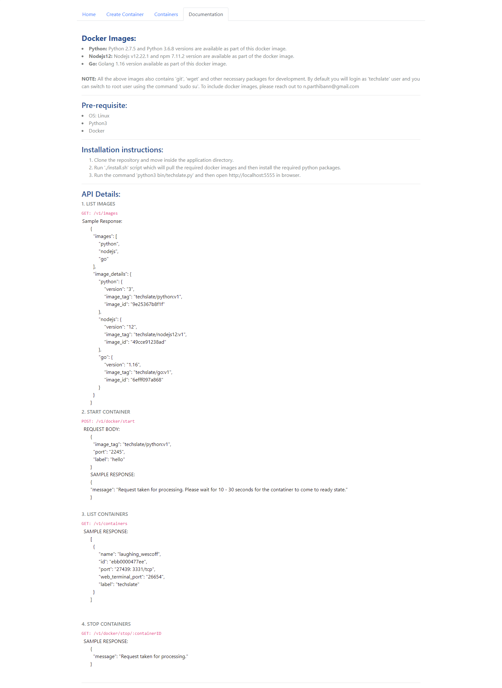

### Home Page

TechSlate home page contains information about the architecture of the application and the use cases of it.

### Create Container page

##### Fields:

Docker image: Python / Go / Nodejs (mandatory field)

Port: '' (optional value, application port that needs to be exposed outside)

Label: '' (optional value, used for tracking purpose)

### Containers page

This page will contains all the running containers.

##### Fields:

Name: Name of the container

Id: Id of the container

Port: TCP port exposed for external use

Label: Label given at the time of starting the container

Action: 
1. SSH - To access the terminal of the container
2. STOP - To stop the container

##### SSH access to the docker terminal in browser new tab

### Documentation page

